# Ejemplo 2 - Instalación de Hadoop

## Objetivo

* Instalar satisfactoriamente Hadoop en Windows (la instalación es muy laboriosa. Tendrás auxilio de tu Experto para desarrollar el proceso)
* En caso de que tengas una distribución Linux y no viste el video tutorial del PreWork (nota: la instalación en Linux es sumamente mucho más sencilla) puedes consultarlo ahora mismo, o requerir ayuda del Experto.

## Desarrollo

>**💡 Nota para experto(a)**

Se ha omitido agregar la instalación de Hadoop y Java en el prework debido a que su instalación es bastante laboriosa y algo confusa para Windows (el sistema más usado  en el mundo). Es por ello que es necesario que con ayuda del presente Work los       alumnos desarrollen autonomamente su instalación y solo recuran a ti en caso de    necesitar ayuda en un paso en particular.
>

¡Bien! Ahora procedamos a instalar Hadoop. Para ello, deberás descomprimir en una nueva carpeta el contenido del archivo .tar.gz que descargaste de la web de Apache, ¡paciencia, puede llegar a tardar hasta 15 minutos! En caso de que no cuentes con 7zip o WinRar, te ofrezco los siguientes links de descarga para que los bajes o instales alguno de ellos:
- Descarga aquí 7zip: https://www.7-zip.org/download.html
- Descarga aquí Winrar: https://www.win-rar.com/download.html?&L=6

Es normal que tu 7zip o WinRar te muestre el siguiente error (solo da click en close o cerrar)

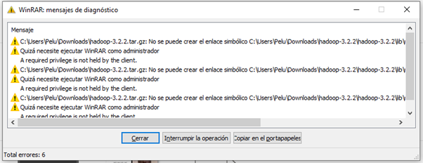

Ahora, en la misma raíz de la unidad donde tienes Windows, crea una carpeta llamada ‘hadoop’ y pega el contenido de la carpeta recién descomprimida. El contenido de la nueva carpeta en la raíz de tu unidad debe lucir así:

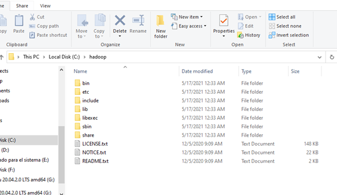

Ahora, deberás modificar algunos archivos contenidos en la siguiente ruta:
- haddop > etc > hadoop >

Dentro de esta deberás ubicar los siguientes 5 archivos:
-	core-site.xml
-	hdfs-site.xml
-	mapred-site.xml
-	yarn-site.xml
-	hadoop-env.cmd (windows command script)

Ahora bien, con ayuda de tu IDE favorita para programar, edita los archivos antes mencionados (en este caso usaré visual studio code, pero puede usar Sublime, o el de tu preferencia). Primero modificaremos “core-site.xml”. Verás el código de la siguiente forma:

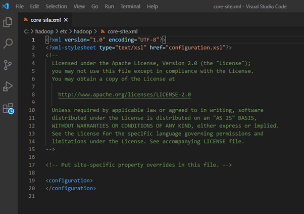

Lo que harás a continuación será agregar después de la línea 19 lo siguiente (recuerda que respetar la identación es elemental):

  [comment]: # (<property>
    <name>fs.defaultFS</name>
    <value>hdfs://localhost:9000</value>
  </property>)

Debe quedar así (recuerda guardarlo):

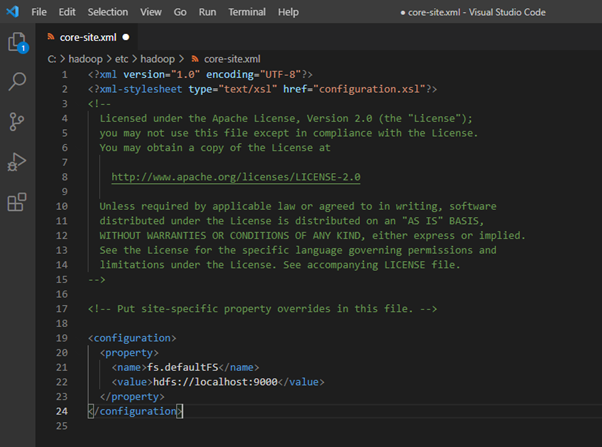

Ahora modificaremos “mapred-site.xml”. Originalmente está así:

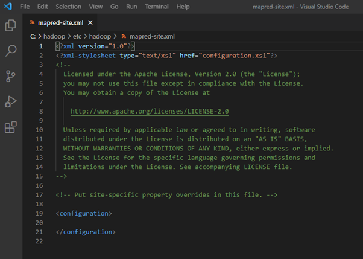

  <property>
    <name>mapreduce.framework.name</name>
    <value>yarn</value>
  </property>

Debería quedar así (no olvides guardarlo):

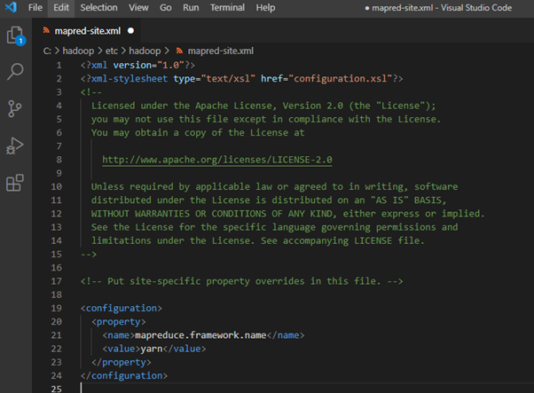

Ahora modificaremos yarn-site.xml. Originalmente está así:

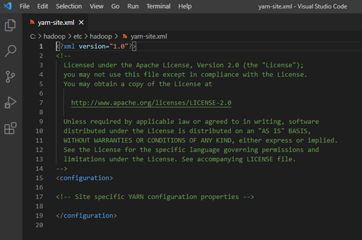

Justo en la línea 17 debemos remplazar el valor comentado de configuraciones específicas YARN con lo siguiente:

<configuration>
  <property>
    <name>yarn.nodemanager.aux-services</name>
    <value>mapreduce_shuffle</value>
  </property>
  <property>
    <name>yarn.nodemanager.auxservices.mapreduce.shuffle.class</name>
    <value>org.apache.hadoop.mapred.ShuffleHandler</value>
</property>
</configuration>

Debería quedar así:

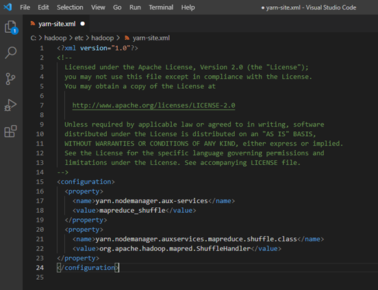

Guardalo. Ahora debes abrir ‘hdfs-site-xml’. Verás lo siguiente:

despues de <configuration> deberás escribir lo siguiente:

  <property>
    <name>dfs.replication</name>
    <value>1</value>
  </property>
  <property>
    <name>dfs.namenode.name.dir</name>
    <value>C:\hadoop\data\namenodez</value>
  </property>
  <property>
    <name>dfs.datanode.data.dir</name>
    <value>C:\hadoop\data\datanode</value>
  </property>

Deberá quedar así. Guardalo:

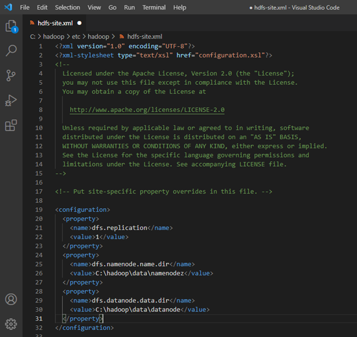

Ahora abre ‘hadoop-env.cmd’. Verás algo así:

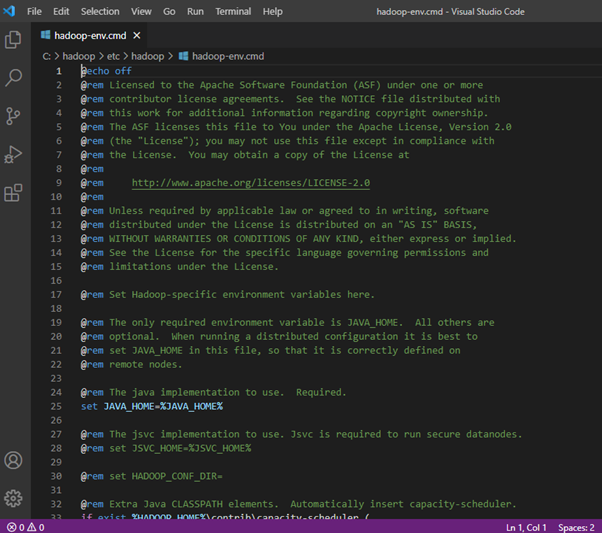

¿Recuerdas que ubicamos jdk (carpeta de instalación de java) en una carpeta en el root de tu unidad? busca la ruta en tu navegador y copiala, deberás pegarla en la línea 25 ‘set JAVA_HOME=%JAVA_HOME%’, tal como puedes apreciar (sino recuerdas la ubicación puedes consultarla en sytem variables):

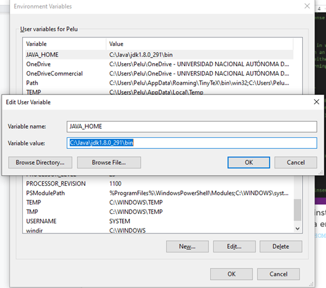

Deberá quedar así (debes borrarle el /bin). Guarda y cierra el archivo:

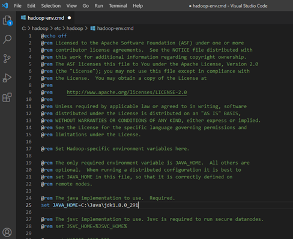

¡Enhorabuena! ahora solo debemos introducir a Hadoop como una nueva variable de sistema (regresa una vez más a environment variables). Selecciona la opción New o Nueva, e introduce lo siguiente (Variable_value es igual a la ruta de la carpeta de Hadoop en el root de tu unidad, en específico la carpeta bin):

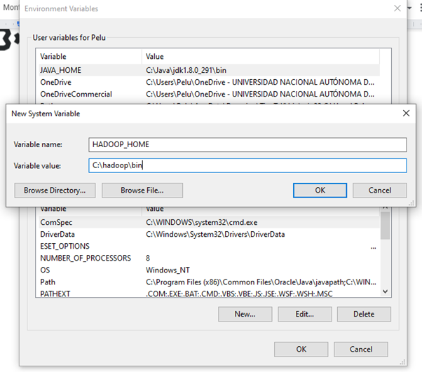

Ahora, en System Variables, selecciona Path y da click en Edit o Editar:

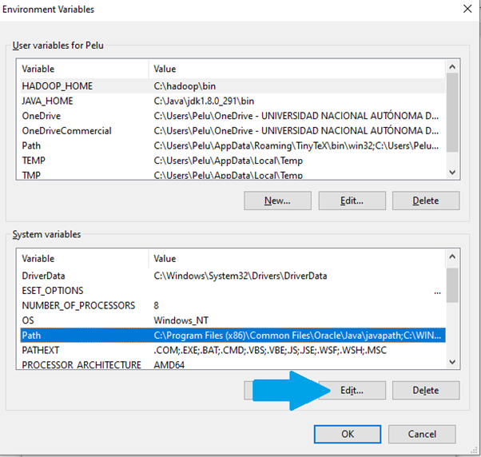

Ahora crea una nueva que sea igual a la ruta de bin dentro de \hadoop:

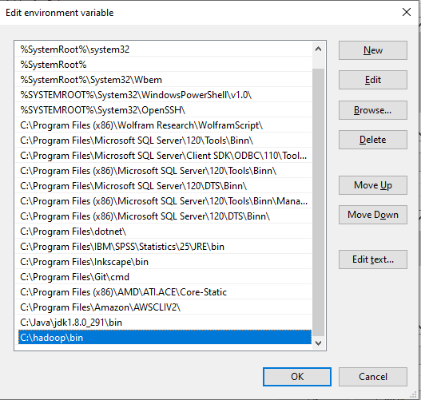

Ahora localiza ‘sbin’ dentro de \hadoop y ubica la ruta de la carpeta. La usara como  una nueva environment variable y la agregaras debajo de la que acabas de definir. Ahora da click en Ok (3 veces para salir de los menús desplegados), y lo que harás a continuación será descargar la carpeta llamada “ConfigHADOOP” en la carpeta de este mismo ejemplo.

Dentro de ella tendrás la carpeta ‘bin’. Lo que deberás hacer a continuación será borrar la carpeta ‘bin’ original de tu C:\hadoop y remplazarla por carpeta ‘bin’ que acabas de descargar:

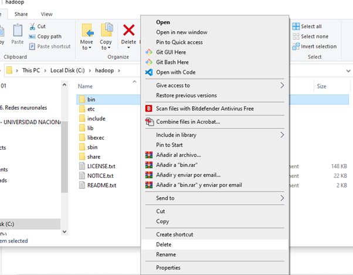

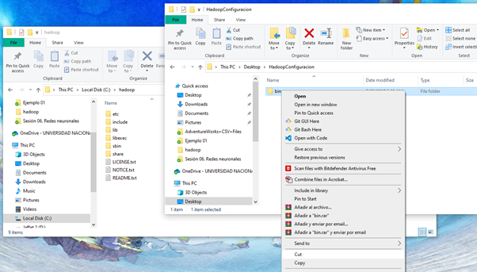

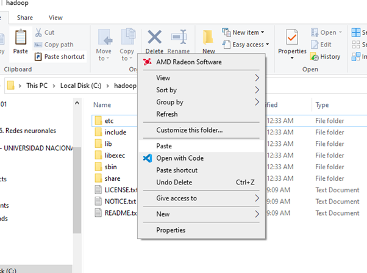

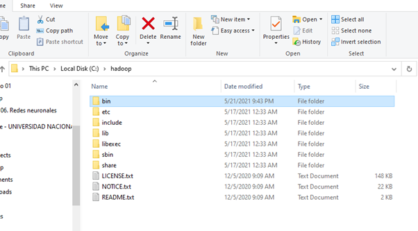

¡Listo! ahora que tienes los ejecutables para poder correr Hadoop en Windows, debemos verificar que ya esté funcionando. Para eso abre el Command Prompt y escribe el siguiente comando:
- hdfs namenode -format

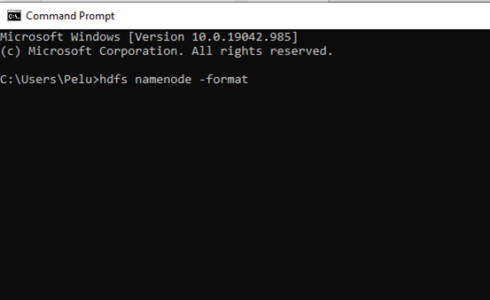

Si todo ha salido bien… ¡Eureka! tu namenode debió haber corrido de la siguiente forma:

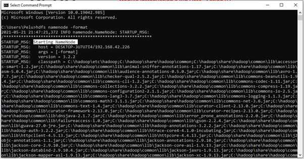

Y el final del prompt debe verse así:

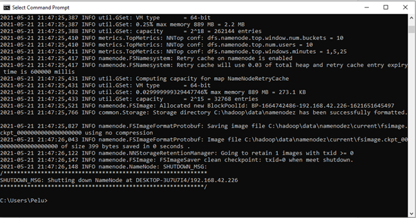

¡Felicidades! ya tienes instalado Hadoop. Vamos al ejemplo 03

