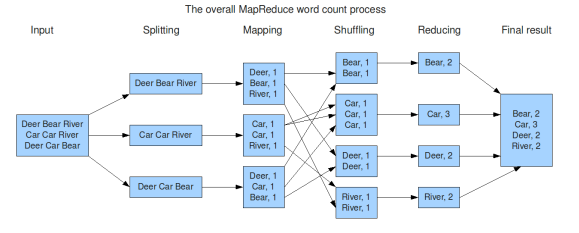

# Ejemplo # 1 - MapReduce

## Objetivo: Escribir una muestra de WordCount MapReduce, empaquetarla y ejecutarla usando Hadoop independiente

Esta Ejercio explica cómo escribir un programa MapReduce simple y cómo ejecutarlo.



Para ejecutar un trabajo de MapReduce, los usuarios deben proporcionar una función de mapa, una función de reducción, datos de entrada y una ubicación de datos de salida. Cuando se ejecuta, Hadoop lleva a cabo los siguientes pasos:

- Hadoop divide los datos de entrada en varios elementos de datos mediante nuevas líneas y ejecuta la función de mapa una vez para cada elemento de datos, dando el elemento como entrada para la función. Cuando se ejecuta, la función de mapa genera uno o más pares clave-valor.

- Hadoop recopila todos los pares clave-valor generados a partir de la función de mapa, los ordena por clave y agrupa los valores con la misma clave.

- Para cada clave distinta, Hadoop ejecuta la función de reducción una vez mientras pasa la clave y la lista de valores para esa clave como entrada.

- La función de reducción puede generar uno o más pares clave-valor, y Hadoop los escribe en un archivo como resultado final.

# ¿A todo esto que MapReduce?

Map es una función que "transforma" elementos de algún tipo de lista en otro tipo de elemento y los vuelve a colocar en el mismo tipo de lista.

supongamos que tengo una lista de números: [1,2,3] y quiero duplicar cada número, en este caso, la función para "duplicar cada número" es la función x = x * 2. Y sin mapeos, podría escribir un simple bucle, digamos

``` 
A = [1, 2, 3]
foreach (item in A) A[item] = A[item] * 2
```

y tendría A = [2, 4, 6] pero en lugar de escribir bucles, si tuviera una función de maps podría escribir.

``` 
A = [1, 2, 3].Map(x => x * 2)
```

la x => x * 2 es una función que se ejecutará contra los elementos en [1,2,3]. Lo que sucede es que el programa toma cada elemento, ejecuta (x => x * 2) contra él haciendo que x sea igual a cada elemento y produce una lista de los resultados.

``` 
1: 1 => 1 * 2: 2
2: 2 => 2 * 2: 4
3: 3 => 3 * 2: 6
```

Así que después de ejecutar la función de mapa con (x => x * 2) tendrías [2, 4, 6].

## Ahora... Que es Reduce?

Reducir es una función que "recopila" los elementos en listas y realiza algunos cálculos en todos ellos, reduciéndolos así a un solo valor.

Encontrar una suma o encontrar promedios son todos ejemplos de una función de reducción. Por ejemplo, si tiene una lista de números, digamos [7, 8, 9] y los quiere resumidos, escribiría un bucle como este.

``` 
A = [7, 8, 9]
sum = 0
foreach (item in A) sum = sum + A[item]
```

Pero, si tiene acceso a una función de reducción, puede escribirla así:

```
A = [7, 8, 9]
sum = A.reduce( 0, (x, y) => x + y )
```

Ahora es un poco confuso por qué se pasan 2 argumentos (0 y la función con xey). Para que una función de reducción sea útil, debe poder tomar 2 elementos, calcular algo y "reducir" esos 2 elementos a un solo valor, por lo que el programa podría reducir cada par hasta que tengamos un solo valor.

La ejecución sería la siguiente:
``` 
result = 0
7 : result = result + 7 = 0 + 7 = 7
8 : result = result + 8 = 7 + 8 = 15
9 : result = result + 9 = 15 + 9 = 24
```

Pero no desea comenzar con ceros todo el tiempo, por lo que el primer argumento está ahí para permitirle especificar un valor semilla específicamente el valor en la primera línea result =.

digamos que desea sumar 2 listas, podría verse así:

```
A = [7, 8, 9]
B = [1, 2, 3]
suma = 0
suma = A.reduce (suma, (x, y) => x + y)
suma = B.reduce (suma, (x, y) => x + y)
```
o una versión que es más probable que encuentres en el mundo real:
```
A = [7, 8, 9]
B = [1, 2, 3]

sum_func = (x, y) => x + y
sum = A.reduce( B.reduce( 0, sum_func ), sum_func )
```

Es algo bueno en un software de base de datos porque, con el soporte de Map \ Reduce, puede trabajar con la base de datos sin necesidad de saber cómo se almacenan los datos en una base de datos para usarla, para eso es un motor de base de datos.

Solo necesita poder "decirle" al motor lo que desea proporcionándoles una función Mapa o Reducir y luego el motor de base de datos podría encontrar su camino alrededor de los datos, aplicar su función y obtener los resultados que usted necesita. quiero todo sin que sepas cómo se repite en todos los registros.

Hay índices, claves, uniones y vistas y una gran cantidad de elementos que una sola base de datos podría contener, por lo que al protegerlo contra cómo se almacenan realmente los datos, su código se hace más fácil de escribir y mantener.

Lo mismo ocurre con la programación paralela, si solo especifica lo que quiere hacer con los datos en lugar de implementar el código de bucle, entonces la infraestructura subyacente podría "paralelizar" y ejecutar su función en un bucle paralelo simultáneo por usted.
