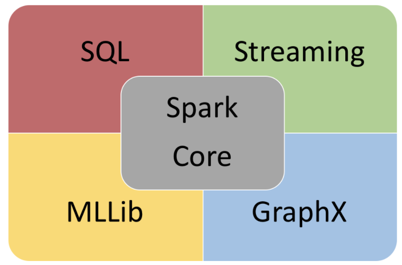
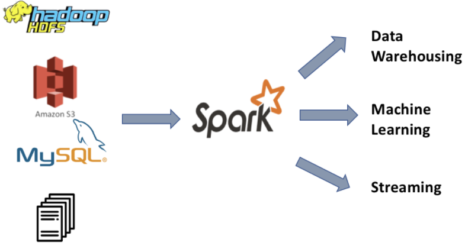
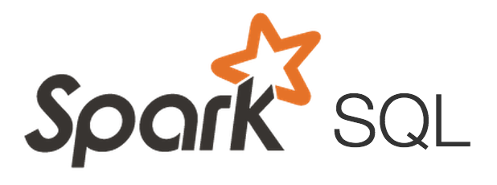
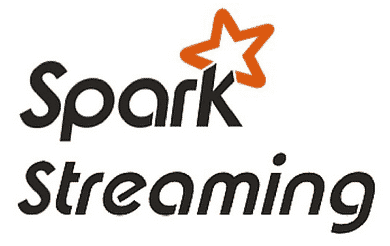
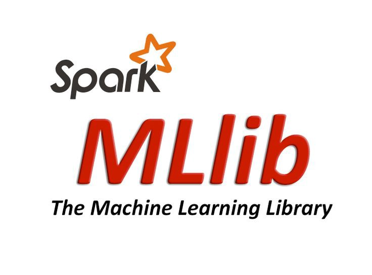
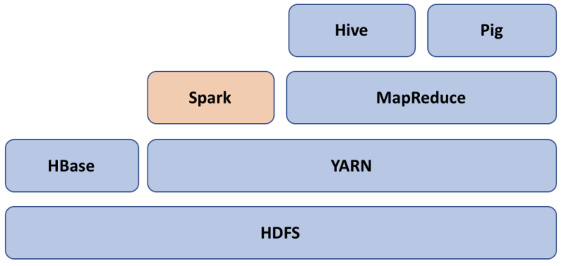

# Ejemplo 2 - Ambiente Spark

## Componentes de Spark

Como se discutió anteriormente en este capítulo, la filosofía principal detrás de Spark es proporcionar un motor unificado para crear diferentes tipos de aplicaciones de big data. Spark proporciona una variedad de bibliotecas para trabajar con análisis por lotes, transmisión, aprendizaje automático y análisis de gráficos.

No es como si este tipo de procesamiento nunca se hubiera realizado antes de Spark, pero para cada nuevo problema de big data, había una nueva herramienta en el mercado; por ejemplo, para el análisis de lotes, teníamos MapReduce, Hive y Pig. Para Streaming, teníamos Apache Storm, para el aprendizaje automático, teníamos Mahout. Aunque estas herramientas resuelven los problemas para los que están diseñadas, cada una de ellas requiere una curva de aprendizaje. Aquí es donde Spark aporta ventajas. Spark proporciona una pila unificada para resolver todos estos problemas. Tiene componentes que están diseñados para procesar todo tipo de big data. También proporciona muchas bibliotecas para leer o escribir diferentes tipos de datos, como JSON, CSV y Parquet.

Aquí hay un ejemplo de una stack de Spark:

Tener una stack unificado trae muchas ventajas. Veamos algunas:

Primero está el uso compartido y la reutilización de código. El equipo de ciencia de datos puede integrar fácilmente los componentes desarrollados por el equipo de ingeniería de datos para evitar la redundancia de código.

En segundo lugar, siempre hay una nueva herramienta en el mercado para resolver un caso de uso de big data diferente. La mayoría de los desarrolladores luchan por aprender nuevas herramientas y adquirir experiencia para usarlas de manera eficiente. Con Spark, los desarrolladores solo tienen que aprender los conceptos básicos que les permiten trabajar en diferentes casos de uso de big data.

En tercer lugar, su pila unificada brinda a los desarrolladores un gran poder para explorar nuevas ideas sin instalar nuevas herramientas.

## Spark SQL

Spark SQL es donde los desarrolladores pueden trabajar con datos estructurados y semiestructurados como tablas Hive, tablas MySQL, archivos Parquet, archivos AVRO, archivos JSON, archivos CSV y más. Otra alternativa para procesar datos estructurados es usar Hive. Hive procesa datos estructurados almacenados en HDFS mediante Hive Query Language (HQL). Utiliza MapReduce internamente para su procesamiento, y veremos cómo Spark puede ofrecer un mejor rendimiento que MapReduce. En la versión inicial de Spark, los datos estructurados solían definirse como RDD de esquema (otro tipo de RDD). Cuando hay datos junto con el esquema, SQL se convierte en la primera opción para procesar esos datos. Spark SQL es el componente de Spark que permite a los desarrolladores procesar datos con Structured Query Language (SQL).

Con Spark SQL, la lógica empresarial se puede escribir fácilmente en SQL y HQL. Esto permite a los ingenieros de almacenamiento de datos con un buen conocimiento de SQL hacer uso de Spark para su procesamiento de extracción, transformación y carga (ETL). Los proyectos de Hive se pueden migrar fácilmente a Spark mediante Spark SQL, sin cambiar los scripts de Hive.

Spark SQL también es la primera opción para el análisis y el almacenamiento de datos. Spark SQL permite a los analistas de datos escribir consultas ad hoc para su análisis exploratorio. Spark proporciona el shell SQL de Spark, donde puede ejecutar consultas similares a SQL y se ejecutan en Spark. Spark convierte internamente el código en una cadena de cálculos RDD, mientras que Hive convierte el trabajo HQL en una serie de trabajos MapReduce. Con Spark SQL, los desarrolladores también pueden hacer uso del almacenamiento en caché (una función de Spark que permite que los datos se mantengan en la memoria), lo que puede aumentar significativamente el rendimiento de sus consultas.

## Spark Streaming

Spark Streaming es un paquete que se utiliza para procesar un flujo de datos en tiempo real. Puede haber muchos tipos diferentes de flujo de datos en tiempo real; por ejemplo, un sitio web de comercio electrónico que registra las visitas a la página en tiempo real, transacciones con tarjetas de crédito, una aplicación de proveedor de taxis que envía información sobre viajes e información de ubicación de conductores y pasajeros, y más. En pocas palabras, todas estas aplicaciones están alojadas en varios servidores web que generan registros de eventos en tiempo real.

Spark Streaming hace uso de RDD y define algunas API más para procesar el flujo de datos en tiempo real. Como Spark Streaming hace uso de RDD y sus API, es fácil para los desarrolladores aprender y ejecutar los casos de uso sin aprender una pila de tecnología completamente nueva.

Spark 2.x introdujo la transmisión estructurada, que utiliza DataFrames en lugar de RDD para procesar la transmisión de datos. El uso de DataFrames como su abstracción de cálculo brinda todos los beneficios de la API de DataFrame para el procesamiento de transmisión. Discutiremos los beneficios de DataFrames sobre RDD en los próximos capítulos.

## Spark Machine Learning

Es difícil ejecutar un algoritmo de aprendizaje automático cuando sus datos se distribuyen en varias máquinas. Puede darse el caso de que el cálculo dependa de otro punto almacenado o procesado en un ejecutor diferente. Los datos se pueden barajar entre ejecutores o trabajadores, pero la mezcla tiene un alto costo. Spark proporciona una forma de evitar la reproducción aleatoria de datos. Sí, está almacenando en caché. La capacidad de Spark para mantener una gran cantidad de datos en la memoria facilita la escritura de algoritmos de aprendizaje automático.

Spark MLlib y ML son los paquetes de Spark para trabajar con algoritmos de aprendizaje automático tales como Clasificación, Clustering y más.

## Spark graph processing

Spark también tiene un componente para procesar datos gráficos. Un gráfico consta de vértices y aristas. Los bordes definen la relación entre vértices. Algunos ejemplos de datos de gráficos son las calificaciones de productos de los clientes, las redes sociales, las páginas de Wikipedia y sus enlaces, los vuelos al aeropuerto y más.

Spark proporciona GraphX para procesar dichos datos. GraphX utiliza RDD para su cálculo y permite a los usuarios crear vértices y aristas con algunas propiedades. Con GraphX, puede definir y manipular un gráfico u obtener información a partir del gráfico.

GraphFrames es un paquete externo que hace uso de DataFrames en lugar de RDD y define la relación vértice-borde usando un DataFrame.

## Cluster manager

Spark proporciona un modo local para la ejecución del trabajo, donde tanto el controlador como los ejecutores se ejecutan dentro de una única JVM en la máquina cliente. Esto permite a los desarrolladores comenzar rápidamente con Spark sin crear un clúster. Utilizaremos principalmente este modo de ejecución de trabajos a lo largo de este libro para nuestros ejemplos de código y explicaremos los posibles desafíos con un modo de clúster siempre que sea posible. Spark también funciona con una variedad de horarios. Veamos una descripción general rápida de ellos aquí.

### Standalone scheduler

Spark viene con su propio programador, llamado programador independiente. Si está ejecutando sus programas Spark en un clúster que no tiene una instalación de Hadoop, existe la posibilidad de que esté utilizando el programador independiente predeterminado de Spark.

### YARN

YARN es el programador predeterminado de Hadoop. Está optimizado para trabajos por lotes como MapReduce, Hive y Pig. La mayoría de las organizaciones ya tienen Hadoop instalado en sus clústeres; por lo tanto, Spark brinda la capacidad de configurarlo con YARN para la programación del trabajo.

### Mesos

Spark también se integra bien con Apache Mesos, que se basa en los mismos principios que el kernel de Linux. A diferencia de YARN, Apache Mesos es un administrador de clústeres de propósito general que no se vincula al ecosistema de Hadoop. Otra diferencia entre YARN y Mesos es que YARN está optimizado para cargas de trabajo por lotes de larga ejecución, mientras que Mesos, la capacidad de proporcionar una asignación de recursos dinámica y detallada lo hace más optimizado para trabajos de transmisión.

### Kubernetes

Kubernetes es un marco de trabajo de orquestación de propósito general para ejecutar aplicaciones en contenedores. Kubernetes proporciona varias funciones, como la tenencia múltiple (ejecutar diferentes versiones de Spark en un clúster físico) y el uso compartido del espacio de nombres. En el momento de escribir este libro, el programador de Kubernetes todavía se encuentra en la etapa experimental. Para obtener más detalles sobre la ejecución de una aplicación Spark en Kubernetes, consulte la documentación de Spark.

## Hadoop y Spark

Las personas generalmente se confunden entre Hadoop y Spark y cómo se relacionan. La intención de esta sección es discutir las diferencias entre Hadoop y Spark, y también cómo se pueden usar juntos.

Hadoop es principalmente una combinación de los siguientes componentes:

- Hive and Pig
- MapReduce
- YARN
- HDFS

HDFS es la capa de almacenamiento donde se pueden almacenar los datos subyacentes. HDFS proporciona funciones como la replicación de datos, tolerancia a fallas, alta disponibilidad y más. Hadoop es un esquema al leer; por ejemplo, no es necesario que especifique el esquema mientras escribe los datos en Hadoop, sino que puede usar diferentes esquemas mientras lee los datos. HDFS también proporciona diferentes tipos de formatos de archivo, como TextInputFormat, SequenceFile, NLInputFormat y más. Si desea saber más sobre estos formatos de archivo, le recomendaría leer Hadoop: The Definitive Guide de Tom White.

MapReduce de Hadoop es un modelo de programación que se utiliza para procesar los datos disponibles en HDFS. Consta de cuatro fases principales: Mapear, Ordenar, Mezclar y Reducir. Una de las principales diferencias entre Hadoop y Spark es que el modelo MapReduce de Hadoop está estrechamente relacionado con los formatos de archivo de los datos. Por otro lado, Spark proporciona una abstracción para procesar los datos mediante RDD. RDD es como un contenedor de uso general de datos distribuidos. Es por eso que Spark puede integrarse con una variedad de almacenes de datos.

Otra diferencia principal entre Hadoop y Spark es que Spark hace un buen uso de la memoria. Puede almacenar datos en caché en la memoria para evitar la E / S del disco. Por otro lado, los trabajos de MapReduce de Hadoop generalmente involucran múltiples discos de E / S. Normalmente, un trabajo de Hadoop consta de varios trabajos Map y Reduce. Esto se conoce como encadenamiento de MapReduce. Una cadena MapReduce puede verse así: Mapa -> Reducir -> Mapa -> Mapa -> Reducir.

Todos los trabajos reducidos escriben su salida en HDFS para mayor confiabilidad; por lo tanto, cada tarea de mapa junto a ella tendrá que leerla desde HDFS. Esto implica operaciones de E / S de varios discos y hace que el procesamiento general sea más lento. Ha habido varias iniciativas como Tez dentro de Hadoop para optimizar el procesamiento de MapReduce. Como se mencionó anteriormente, Spark crea un DAG de operaciones y optimiza automáticamente las lecturas del disco.

Aparte de las diferencias anteriores, Spark complementa a Hadoop proporcionando otra forma de procesar los datos. Como se discutió anteriormente en este capítulo, se integra bien con componentes de Hadoop como Hive, YARN y HDFS. El siguiente diagrama muestra un ecosistema típico de Spark y Hadoop. Spark utiliza YARN para programar y ejecutar su tarea en todos los clusters:

