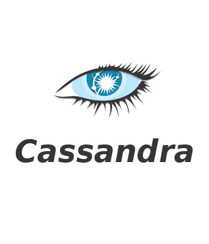

# Ejemplo 1 - Introducción a Cassandra

En algún momento es casi seguro que ha trabajado o escuchar hablar mucho de bases de datos. Debe haber creado productos utilizando bases de datos relacionales como MySQL y PostgreSQL, y quizás haber experimentado con bases de datos NoSQL, incluido un almacén de documentos como MongoDB o un almacén de valor clave como Redis. Si bien cada una de estas herramientas tiene sus puntos fuertes, ahora considerará si una base de datos distribuida como Cassandra podría ser la mejor opción para la tarea en cuestión.

En este ejemplo, comenzaremos con la necesidad de bases de datos NoSQL para satisfacer el enigma de los datos en constante crecimiento. Veremos por qué las bases de datos NoSQL se están convirtiendo en la opción de facto para big data y aplicaciones web en tiempo real. También hablaremos sobre las principales razones para elegir Cassandra entre las muchas opciones de bases de datos disponibles para usted. Habiendo establecido que Cassandra es una gran opción, repasaremos los detalles necesarios para poner en marcha una instalación local de Cassandra. Al final de este capítulo, sabrá lo siguiente:

Qué son los macrodatos y por qué las bases de datos relacionales no son una buena opción
Cuándo y por qué Cassandra es una buena opción para su aplicación
Cómo instalar Cassandra en su máquina de desarrollo
Cómo interactuar con Cassandra usando cqlsh
Cómo crear un espacio de claves, una tabla y escribir una consulta simple

# Requisitos de Hardware

Tal como se estudio en el PreWork, Se recomienda una memoria mínima de 4 GB para entornos de desarrollo y una memoria mínima de 8 GB para entornos de producción. Si nuestro conjunto de datos es más grande, deberíamos considerar actualizar la memoria utilizada por Cassandra. Al igual que la memoria, una mayor cantidad de CPU ayuda a Cassandra a funcionar mejor, ya que Cassandra realiza sus tareas al mismo tiempo.

# Requisitos de Software

- Java: Cassandra puede ejecutarse en Oracle/Sun JVM, OpenJDK e IBM JVM. La versión estable actual de Cassandra requiere Java 7 o una versión posterior. Es necasrio configurar su variable de entorno JAVA_HOME.

- Python: la versión actual de Cassandra requiere Python 3.0 o superior. Las herramientas de Cassandra, como cqlsh, están basadas en Python.

- Configuración de firewall: dado que estamos configurando un clúster, veamos qué puertos usa Cassandra en varias interfaces. Si el firewall bloquea estos puertos porque no los configuramos, entonces nuestro clúster no funcionará correctamente. Por ejemplo, si se bloquea el puerto de comunicación del entrenudo, los nodos no podrán unirse al clúster.

- Sincronización del reloj: dado que Cassandra depende en gran medida de las marcas de tiempo para fines de coherencia de datos, todos los nodos de nuestro clúster deben estar sincronizados. Asegúrese de verificar esto. Uno de los métodos que podemos utilizar para la sincronización horaria es configurar NTP en cada nodo. NTP (Network Time Protocol) es un protocolo ampliamente utilizado para la sincronización del reloj de las computadoras en una red.

## Port/Protocols que deben estar libres:

- 7000/tcp
- 7001/tcp
- 9042/tcp
- 9160/tcp
- 7199/tcp

# Instalación

Apache proporciona código fuente, así como tarballs binarios y paquetes Debian. Sin embargo, los proveedores de terceros, como Datastax, proporcionan el instalador MSI, Linux RPM, paquetes Debian y binarios UNIX y Mac OS X en forma de edición comunitaria, que es una distribución empaquetada gratuita de Apache Cassandra de Datastax. Aquí, cubriremos la instalación usando paquetes tarball binarios y tarball fuente. En el Reto 01, ¡Vamos a instalar Cassandra!