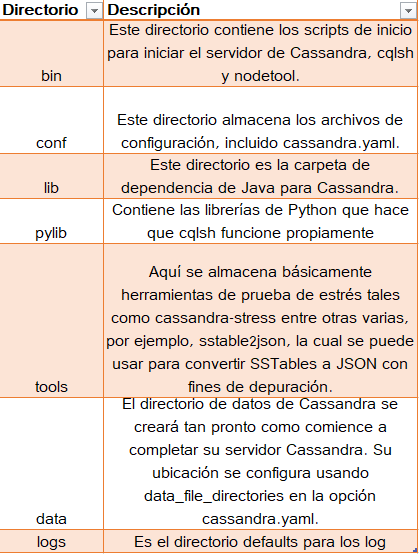

# Ejemplo 2 - Comprendiendo el layout de instalación de Cassandra

## Objetivo

* Entender el funcionamiento y conceptualización de cada uno de los directorios que compone a Cassandra

## Desarrollo

La instalación tarball es diferente al de los paquetes RPM o Debian. Veamos en qué se diferencian.

## La siguiente tabla muestra la lista de directorios y su descripción:

La siguiente tabla describe el diseño de instalación si usa paquetes RPM o Debian (directorios en la instalación basada en paquetes):

## Archivos de configuración

Ahora, veamos algunos archivos de configuración clave y las opciones que podemos configurar en ellos. Los archivos de configuración son los siguientes:

- cluster_name: esta es la cadena de identificación de un clúster lógico. Todos los nodos de un clúster deben tener el mismo valor para esta configuración. El Valor predeterminado es Test Cluster.
-  listen_address: el nodo Cassandra se vinculará a esta dirección. Los otros nodos del clúster pueden comunicarse con este nodo si está configurado correctamente; dejarlo en el valor predeterminado causará una falla en la comunicación de este nodo con otros nodos, ya que el valor predeterminado es la dirección de bucle de retorno localhost, por lo que el nodo no podrá comunicarse con otros nodos que se ejecutan en diferentes máquinas. 

- seed provider: el nodo semilla ayuda a los nodos de Cassandra a aprender sobre otros nodos en el clúster y la topología de anillo mediante el protocolo Gossip. Aprenderemos más sobre el protocolo Gossip en capítulos posteriores. Tiene dos subopciones, una es class_name y la otra es el número de semillas. La clase de inicialización predeterminada toma una lista delimitada por comas de direcciones de nodo. En un clúster multinodo, la lista de semillas debe tener al menos un nodo. Esta lista debe ser común para todos los nodos. El valor predeterminado es -class_name: org.apache.cassandra.locator.SimpleSeedProvider-seeds: "127.0.0.1".
Propina.

## NOTA: 
La lista de semillas debe tener más de un nodo para la tolerancia a fallas del proceso de arranque. En un clúster centralizado de datos múltiples, al menos un nodo de cada centro de datos debe participar como nodo de origen de semillas. También recuerda que un nodo no puede ser un nodo semilla si es un nodo de arranque.

